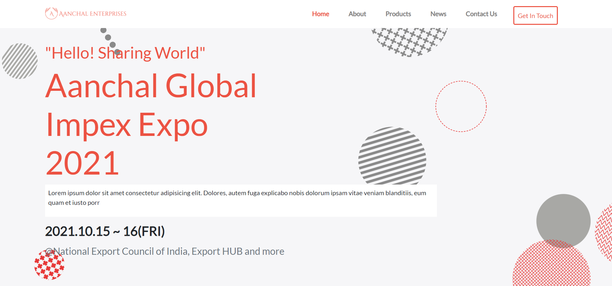
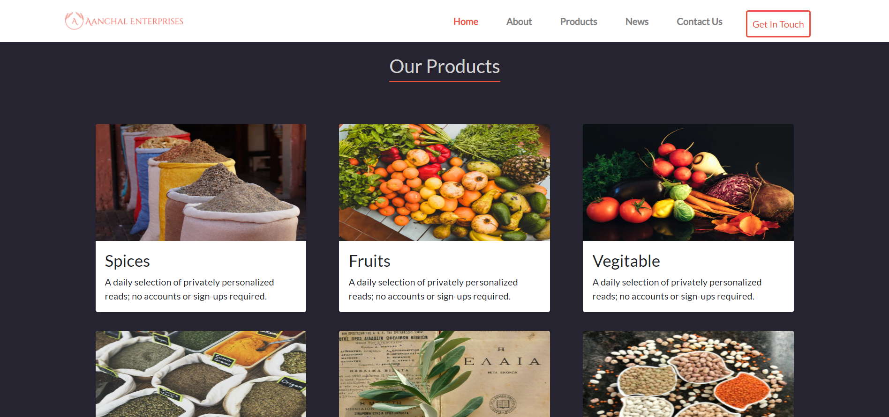
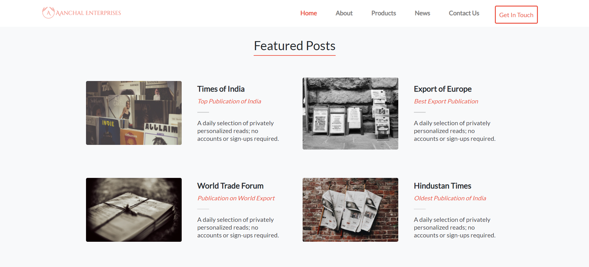
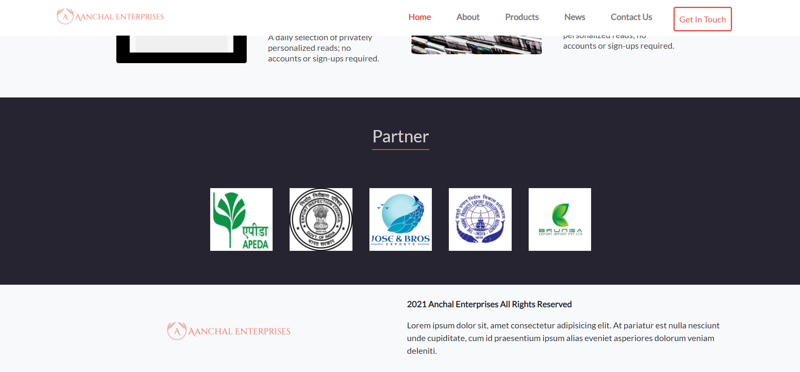
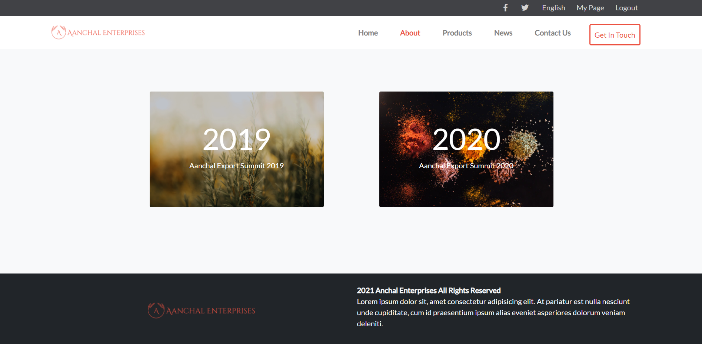

# Aanchal Enterprises

> This is a Aanchal Global Impex Expo website, through which you can get al the product list and summit information. Enjoy Watching!

## Desktop Version

Additional description about the project and its features.

## LIVE DEMO

- [Live Demo](https://hector096.github.io/My-Portfolio/)

## Built With

- HTML & CSS
- Javascript
- Github

## Getting Started

To get a local copy up and running follow these simple example steps.

### Prerequisites

You have a basic understanding of HTML,CSS,JavaScript, Git and Github. 

### Setup

1. Clone the repository with *git clone: [Repository](https://github.com/Hector096/Conference-App)  
2. Run *index.html* in for browser.

## Authors

- GitHub: [@githubhandle](https://github.com/Hector096)
- Linkedin: [@twitterhandle](https://www.linkedin.com/in/vishal-verma-9191b8126/)

## 🤝 Contributing

Contributions, issues, and feature requests are welcome!

Feel free to check the [issues page](https://github.com/Hector096/Conference-App/issues).

## Show your support

Give a ⭐️ if you like this project!

## Acknowledgments

- Hat tip to anyone whose code was used
- Inspiration
- etc

## 📝 License

This project is [MIT](./MIT.md) licensed.